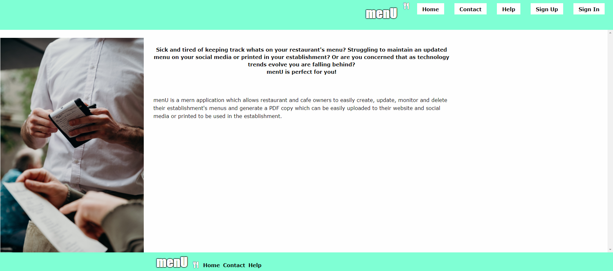

# menU




[Click here to view repository.](https://github.com/anjkrish2608/menu)

[Click here to access the application on heroku.](https://men-u.herokuapp.com/)

## Table of Contents

* [Description of Application](#des)
* [Technologies Used](#tech)
* [Challenges Faced](#chall)
* [Features to be Implemented](#dev)
* [Installation Steps](#insta)
* [Tests](#tests)
* [How to Use](#use)
* [Licence](#lic)
* [Credits](#cred)

<a id="des"></a>

## Description of Application
menU is a MERN web application which allows restaurant owners to easily view, edit and generate a PDF of their menu. A restaurant owner must sign up and on login their current menus will be displayed and they can easily edit these, generate new ones and generate a PDF version of their menu to be linked to their website or printed and used in the restaurant. 

<a id="tech"></a>

## Technologies Used
While creating this application I have used many different technologies listed below:

* React : pages and components, useEffect(), useParams(), useState()
* React Router Dom : allow page routes to function and paramters to be passed
* Mongo DB : database modelling 
* Atlas : linked to heroku for online GET and POST routes
* ZURB Foundation CSS : the stylistic features of the page
* JavaScript ES6 : to write all of the code 
* Font Awesome : the knife and fork logo used in header and footer
* Node JS : to run the server.js file


<a id="chall"></a>

## Challenges Faced
When creating this application I faced many challenges overall I am proud of the application I have completed and believe it has a solid foundation which needs some final touches to achieve its full functionality. I found the mongodb documentation on [Modelling One-to-One relationships](https://docs.mongodb.com/manual/tutorial/model-embedded-one-to-one-relationships-between-documents/) and would like to implement this correctly in the future.
REACT COMPONENT ISSUES:
* initially rendering the basic react template with the foundation CSS did not function correctly due to incorrect syntax of the parent components
* react application was not displaying because column size exceeded dimensions
SIGN IN ISSUES:
* sign in not functioning correctly because the useEffect onChange event was not capturing all of the data - changed to useState
* log in route not functioning correctly because many syntax errors made in converting from sequelize to mongodb, some errrors were fixed by [Jared Hamson's comment](https://github.com/jaredhanson/passport/issues/51) and assited by comparing to his working example [here](https://gist.github.com/AndrewHenderson/4315493), as well as the suggestions on [this stackOverflow thread](https://stackoverflow.com/questions/42295987/route-separation-in-express-routing-with-passing-passport-instance)
* sign up page had unprocessable entity issues because these were resolved by changing what was being sent to an object
ROUTE ISSUES:
* api routes not functioning because the routes on front and back end were not matching an 's' was added to user
* passport.js caused errors on heroku because was due to route for when not routes were hit
MENUDB ISSUES:
* seedDB encorporating menu and item models had many errors because asynchronos function errors, ids not passing, proud of end result 
* GET routes for menu and item data not functioning as expected

<a id="dev"></a>

## Features to be Implemented
In the future I would like to complete the function of the application allowing the GET routes to work, models to interact correctly and the PDF generating functionging. Hopefully using the [$lookup syntax](https://docs.mongodb.com/manual/reference/operator/aggregation/lookup/#pipe._S_lookup). Next I would like to have an alert when a user is putting an email which is already used or email of incorrect format. The following stage of development would involve using the google maps API to display nearby restaurants and a link to their PDF (for members only). The third phase of improvements are in the intention of extending the usability of the application. Separate logins and signups would be available to restaurant owners and goers. The restaurant goers would be able to access a single vertical field of cards containing menus, which would allow users to swipe through to read over and upon clicking the restaurants name you would be sent to their profile. On this profile there would be all current menus and the social media and contact details of the restaurant. The final phase will develop business strategy and allow the application to start generating profit. Ideally creating a mutually beneficial relationship with  websites such as TripAdvisor would be integral. menU would provide free ad space in order to access their ratings and vast userbase information. Now that the application has greater usability and data advertisements will be used to generate revenue and the future implementation of joining fee for restaurants will be considered depending on current userbase.


<a id="insta"></a>

## Installation Steps
[Click here to access the application on heroku.](https://men-u.herokuapp.com/)
OR
1. Download the menu folder.
2. Run the terminal in that folder and write the following commands:
```
npm install
npm start
```

<a id="tests"></a>

## Tests
There are currently no tests running for this application.

<a id="use"></a>

## How to Use
After following the Installation steps or accessing the application on [Heroku.](https://men-u.herokuapp.com/) you can sign up and log in. While logged in you can access your previously created menus and create more and when your ready generate the PDF.

<a id="lic"></a>

## Licence
MIT License

Copyright (c) 2020 Anjini Krishnan

Permission is hereby granted, free of charge, to any person obtaining a copy
of this software and associated documentation files (the "Software"), to deal
in the Software without restriction, including without limitation the rights
to use, copy, modify, merge, publish, distribute, sublicense, and/or sell
copies of the Software, and to permit persons to whom the Software is
furnished to do so, subject to the following conditions:

The above copyright notice and this permission notice shall be included in all
copies or substantial portions of the Software.

THE SOFTWARE IS PROVIDED "AS IS", WITHOUT WARRANTY OF ANY KIND, EXPRESS OR
IMPLIED, INCLUDING BUT NOT LIMITED TO THE WARRANTIES OF MERCHANTABILITY,
FITNESS FOR A PARTICULAR PURPOSE AND NONINFRINGEMENT. IN NO EVENT SHALL THE
AUTHORS OR COPYRIGHT HOLDERS BE LIABLE FOR ANY CLAIM, DAMAGES OR OTHER
LIABILITY, WHETHER IN AN ACTION OF CONTRACT, TORT OR OTHERWISE, ARISING FROM,
OUT OF OR IN CONNECTION WITH THE SOFTWARE OR THE USE OR OTHER DEALINGS IN THE
SOFTWARE.

<a id="cred"></a>

## Credits
As mentioned in [Technologies Used](#tech) the following assets were used:
* [JavaScript ES6](https://www.javascript.com/)
* [Node JS](https://nodejs.org/en/)
* [React](https://reactjs.org/)
* [React Router Dom](https://www.npmjs.com/package/react-router-dom)
* [Mongo DB](https://www.mongodb.com/) 
* [Atlas](https://www.mongodb.com/cloud/atlas)
* [ZURB Foundation CSS](https://get.foundation/)
* [Font Awesome](https://fontawesome.com/)

For images I used the website Unsplash.com:
* <span>Photo by <a href="https://unsplash.com/@sunrisephotography?utm_source=unsplash&amp;utm_medium=referral&amp;utm_content=creditCopyText">Sunrise Photos</a> on <a href="https://unsplash.com/?utm_source=unsplash&amp;utm_medium=referral&amp;utm_content=creditCopyText">Unsplash</a></span>
* <span>Photo by <a href="https://unsplash.com/@littlegreeneyes?utm_source=unsplash&amp;utm_medium=referral&amp;utm_content=creditCopyText">Jessie McCall</a> on <a href="https://unsplash.com/s/photos/menu?utm_source=unsplash&amp;utm_medium=referral&amp;utm_content=creditCopyText">Unsplash</a></span>

I consulted [this post](https://stackoverflow.com/questions/57464935/font-outline-using-only-css) on Stack Overflow to generate the main font.
I also consulted [this working example](https://get.foundation/templates-previews-sites-f6-xy-grid/portfolio.html?fbclid=IwAR1KCDDolX5v7Kh7wUS9k-9TQiM1zqF7-f5WUiJfwX4YHeHaNDHEQsWFLbk) to create the sidebar.
Without [the MongoDB documentation](https://docs.mongodb.com/manual/introduction/) and [StackOverflow](https://stackoverflow.com/) I would not be able to overcome the challenges I faced while gaining actual understanding.
Furthermore the requirements set for this application were supplied by Trilogy Education Services.

© 2019 Trilogy Education Services, a 2U, Inc. brand. All Rights Reserved.
Copyright (c) 2020 Anjini Krishnan